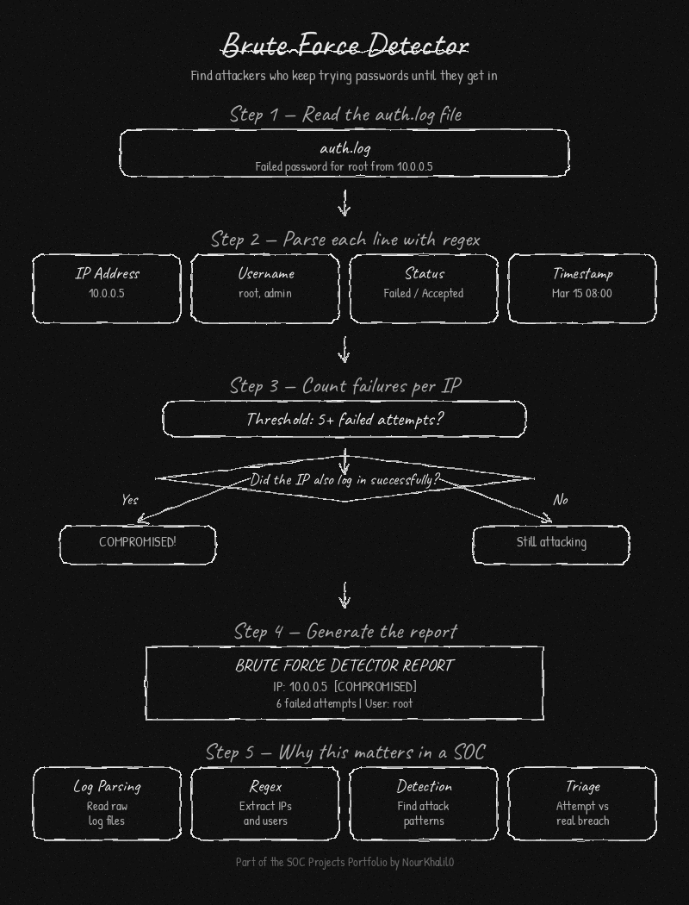

# 🔐 Brute Force Detector


This tool reads a Linux SSH log file and finds IP addresses that have failed to log in too many times. It also checks if any of those IPs eventually got in, which is a sign that something was compromised.

---



---

## ✨ Features

- Flags IP addresses that fail to log in more than a set number of times
- Marks an IP as COMPROMISED if it failed many times and then succeeded
- Shows which usernames each IP tried to use
- Has a built-in demo mode so you can test it without a real server
- No external packages needed, just Python

---

## 🛠 Requirements

- Python 3.7 or higher
- A Linux auth log file like `/var/log/auth.log` or `/var/log/secure`

---

## 📦 Installation

```bash
git clone https://github.com/NourKhalil0/soc-projects.git
cd soc-projects/01-brute-force-detector
```

---

## 🚀 Usage

Run with the default log file:
```bash
python3 brute_force_detector.py
```

Use a different log file:
```bash
python3 brute_force_detector.py -f /var/log/secure
```

Change how many failures count as suspicious:
```bash
python3 brute_force_detector.py -t 10
```

Run the demo to see how it works:
```bash
python3 brute_force_detector.py --demo
```

---

## 📊 Example Output

```
========================================
       BRUTE FORCE DETECTOR REPORT
========================================
Threshold: 5 failed attempts

IP: 10.0.0.5  [COMPROMISED]
  Failed attempts : 6
  Targeted users  : root
  Successful login: Mar 15 08:01:22 as root

IP: 192.168.1.99  [ATTACKING]
  Failed attempts : 5
  Targeted users  : admin, guest, oracle, test, ubuntu

========================================
```

---

## 📚 What you learn

| Skill | Description |
|-------|-------------|
| Log parsing | Reading and searching through raw log files |
| Regex | Extracting IPs, usernames and timestamps from text |
| Threat detection | Finding patterns that look like attacks |
| Incident triage | Telling the difference between an attempt and a real breach |

---

## 📁 Project Structure

```
01-brute-force-detector/
├── brute_force_detector.py
├── requirements.txt
├── .gitignore
└── README.md
```

---

## 📄 License

MIT

---

*Part of the SOC Projects Portfolio by NourKhalil0*
