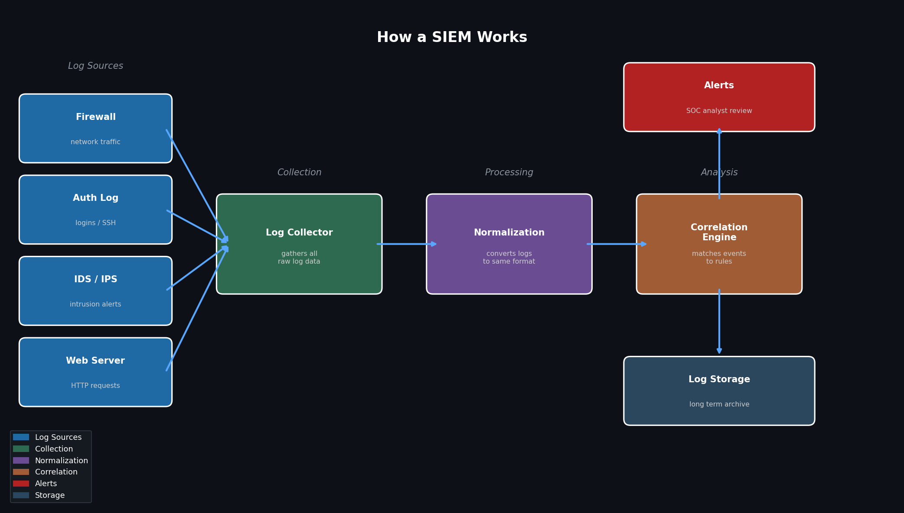

# 📊 SIEM Log Normalizer


This tool reads log files from different sources like firewalls, SSH, and web servers, and turns them all into one normalized report. It assigns each event a severity level and shows the most critical ones first, the same way a real SIEM would present information to an analyst.

---

## How a SIEM Works



A SIEM collects logs from many different systems, converts them into a common format, runs rules to find suspicious patterns, and then creates alerts for the SOC team to investigate. This project simulates the collection and normalization steps.

---

## Features

- Reads logs from multiple files at the same time
- Detects the log source automatically (SSH, firewall, web server, etc.)
- Gives each event a severity level: CRITICAL, HIGH, MEDIUM, LOW or INFO
- Sorts results so the most serious events show up first
- Includes a demo mode with three sample log files so you can test it right away

---

## Requirements

- Python 3.7 or higher
- No external packages needed

---

## Installation

```bash
git clone https://github.com/NourKhalil0/soc-projects.git
cd soc-projects/02-siem-log-normalizer
```

---

## Usage

Run with the demo log files:
```bash
python3 siem_normalizer.py --demo
```

Run on your own log files:
```bash
python3 siem_normalizer.py -f /var/log/auth.log /var/log/syslog
```

Run on multiple log files at once:
```bash
python3 siem_normalizer.py -f auth.log firewall.log web.log
```

---

## Example Output

```
========================================
         SIEM NORMALIZER REPORT
========================================
Files scanned : 3
Total events  : 12
  CRITICAL    : 1
  HIGH        : 5
  MEDIUM      : 2
  LOW         : 3
  INFO        : 1
========================================

[CRITICAL] Mar 15 08:00:05  src=ssh  ip=10.0.0.5
           Accepted password for root from 10.0.0.5 port 22

[HIGH    ] Mar 15 08:00:01  src=ssh  ip=10.0.0.5
           Failed password for root from 10.0.0.5 port 22

[HIGH    ] Mar 15 08:05:00  src=firewall  ip=10.10.10.10
           iptables BLOCKED IN=eth0 SRC=10.10.10.10 DST=192.168.1.1

[MEDIUM  ] Mar 15 09:00:10  src=web  ip=10.0.0.4
           10.0.0.4 - - "GET /admin HTTP/1.1" 403

========================================
```

---

## What you learn

| Skill | Description |
|-------|-------------|
| Log normalization | Converting different log formats into one structure |
| Severity classification | Deciding how serious an event is based on its content |
| Multi-source analysis | Working with logs from firewalls, SSH and web servers |
| SIEM concepts | Understanding how real SIEM tools process and display events |

---

## Project Structure

```
02-siem-log-normalizer/
├── siem_normalizer.py
├── siem_diagram.png
├── requirements.txt
├── .gitignore
└── README.md
```

---

## License

MIT

---

*Part of the SOC Projects Portfolio by NourKhalil0*
