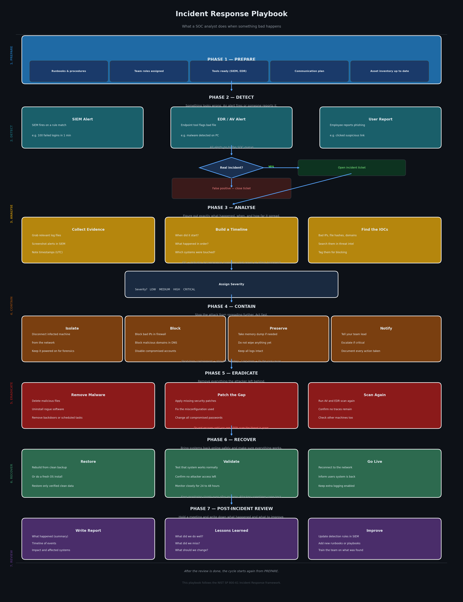

# 🚨 Incident Response Playbook


This project shows the full process a SOC analyst follows when an incident happens. It covers all 7 phases from start to finish, based on the NIST incident response framework. The diagram below is the main part of this project.

---

## The Full Playbook



---

## The 7 Phases

**Phase 1 — Prepare**
Get everything ready before anything goes wrong. This means writing runbooks, setting up tools like a SIEM and EDR, assigning roles, and making sure the team knows what to do.

**Phase 2 — Detect**
An alert fires from the SIEM, the EDR, or a user reports something. The analyst checks if it is a real incident or a false positive. If it is real, a ticket gets opened.

**Phase 3 — Analyse**
Figure out what actually happened. Collect logs, build a timeline, find the IOCs (bad IPs, file hashes, domains), and assign a severity level to the incident.

**Phase 4 — Contain**
Stop the attack from spreading. Isolate infected machines, block bad IPs in the firewall, disable compromised accounts, and document everything.

**Phase 5 — Eradicate**
Remove everything the attacker left behind. Delete malicious files, apply missing patches, change compromised passwords, and run a clean scan to confirm the threat is gone.

**Phase 6 — Recover**
Bring systems back online. Restore from a clean backup, test that everything works, reconnect to the network, and monitor closely for the next 48 hours.

**Phase 7 — Post-Incident Review**
Hold a lessons learned meeting. Write an incident report, update detection rules in the SIEM, and improve runbooks so the team handles it better next time.

---

## Usage

Print the full checklist:
```bash
python3 ir_checklist.py
```

Print just one phase:
```bash
python3 ir_checklist.py -p 3-analyse
```

---

## Example Output

```
========================================
    INCIDENT RESPONSE CHECKLIST
========================================

Phase 3 — Analyse
----------------------------------------
  [ ] 1. Collect relevant log files and screenshots
  [ ] 2. Build a timeline of what happened
  [ ] 3. Find all IOCs (bad IPs, hashes, domains)
  [ ] 4. Search IOCs in threat intelligence sources
  [ ] 5. Assign a severity level to the incident

========================================
```

---

## Key Terms

| Term | What it means |
|------|---------------|
| IOC | Indicator of Compromise. Something that proves an attack happened, like a bad IP or a suspicious file hash |
| SIEM | A tool that collects logs from all systems and fires alerts when something looks wrong |
| EDR | Endpoint Detection and Response. A tool that watches what programs do on a computer |
| Runbook | A step by step guide for handling a specific type of incident |
| False positive | An alert that looked like an attack but turned out to be nothing |
| Severity | How serious the incident is, usually rated LOW, MEDIUM, HIGH or CRITICAL |

---

## What you learn

| Skill | Description |
|-------|-------------|
| Incident response | Understanding the full IR lifecycle from detection to review |
| NIST framework | Knowing how the industry standard IR process is structured |
| SOC workflow | Seeing how an analyst thinks and acts during an incident |
| Documentation | Writing reports and checklists the way a real SOC team does |

---

## Project Structure

```
03-incident-response-playbook/
├── ir_checklist.py
├── ir_diagram.png
├── requirements.txt
├── .gitignore
└── README.md
```

---

## License

MIT

---

*Part of the SOC Projects Portfolio by NourKhalil0*
