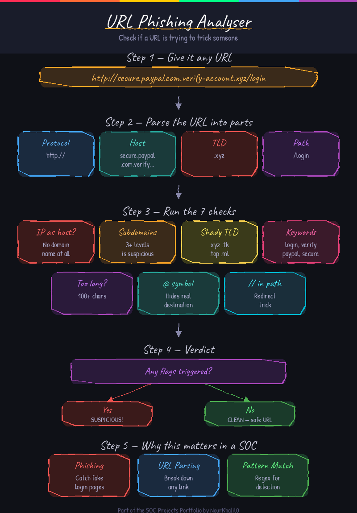

# 🔗 URL Phishing Analyser


A command-line tool that checks a URL for common phishing patterns. It looks at things like whether the host is an IP address, how many subdomains are stacked up, whether the TLD is suspicious, and whether the URL contains keywords often seen in phishing links.



## Features

- Detects IP addresses used as hostnames instead of real domain names
- Counts subdomains and flags URLs with 3 or more
- Checks for suspicious top-level domains like .xyz, .tk, .top, .ml, .ga, .cf, .gq, .pw
- Searches for common phishing keywords such as login, verify, paypal, account, confirm
- Flags URLs that are longer than 100 characters
- Detects the @ symbol trick that can hide the real destination
- Detects double slashes in the path

## Requirements

- Python 3.8 or higher
- No external libraries needed for the main script

## Installation

```bash
git clone https://github.com/NourKhalil0/soc-projects.git
cd soc-projects/04-url-analyser
pip install -r requirements.txt
```

## Usage

Analyse a single URL:

```bash
python url_analyser.py --url "http://secure.paypal.com.verify-account.xyz/login"
```

Run the built-in demo with sample URLs:

```bash
python url_analyser.py --demo
```

## Example Output

```
URL: http://secure.paypal.com.account-verify.xyz/update
--------------------------------------------------
Result: SUSPICIOUS
Flags (3):
  [!] Too many subdomains (3)
  [!] Suspicious TLD detected
  [!] Phishing keywords found: verify, account, update, secure, paypal


URL: https://www.google.com/search?q=cats
--------------------------------------------------
Result: CLEAN (no suspicious patterns found)
```

## What You Learn

| Skill | Details |
|-------|---------|
| URL parsing | How to break a URL into its parts using urllib |
| Pattern matching | Using regex to find IP addresses in strings |
| Threat indicators | What makes a URL look suspicious in a SOC context |
| Argparse | Building a simple CLI tool with flags |
| Phishing analysis | Common tricks attackers use in phishing URLs |

## Project Structure

```
04-url-analyser/
├── url_analyser.py    # Main script
├── diagram.png        # Visual overview of the analysis flow
├── requirements.txt   # Python dependencies
├── .gitignore         # Git ignore file
└── README.md          # This file
```

## License

MIT

---

Part of the SOC Projects Portfolio by NourKhalil0
