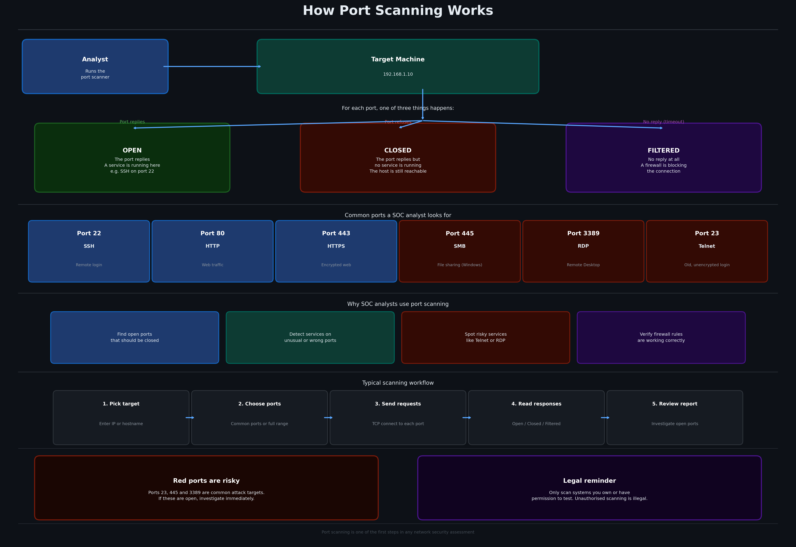

# 🔍 Port Scanner


This tool scans a target machine and checks which ports are open. For each port it tells you the status and what service is likely running there. It is one of the first things a SOC analyst does when checking the security of a network.

---



---

## Features

- Scans common ports by default so you get results fast
- Shows the service name for each open port, for example SSH on port 22
- Lets you scan a custom range of ports or a specific list
- Has a demo mode that scans a public test server so you can try it right away
- Adjustable timeout so you can trade speed for accuracy

---

## Requirements

- Python 3.7 or higher
- No external packages needed

---

## Installation

```bash
git clone https://github.com/NourKhalil0/soc-projects.git
cd soc-projects/05-port-scanner
```

---

## Usage

Run the demo on a public test server:
```bash
python3 port_scanner.py --demo
```

Scan a specific host with default ports:
```bash
python3 port_scanner.py 192.168.1.1
```

Scan specific ports:
```bash
python3 port_scanner.py 192.168.1.1 -p 22,80,443,3389
```

Scan all ports from 1 to 1024:
```bash
python3 port_scanner.py 192.168.1.1 --all
```

---

## Example Output

```
Resolving scanme.nmap.org...
Scanning 17 ports on 45.33.32.156...

========================================
           PORT SCANNER REPORT
========================================
Host     : scanme.nmap.org
IP       : 45.33.32.156
Ports    : 17 scanned
Time     : 3s
========================================

PORT     SERVICE        STATUS
----------------------------------
22       SSH            OPEN
80       HTTP           OPEN

2 open port(s) found.

========================================
```

---

## What you learn

| Skill | Description |
|-------|-------------|
| Network basics | Understanding how TCP connections and ports work |
| Recon techniques | How analysts map out what services are running on a network |
| Python sockets | Using the socket library to make network connections |
| Risk awareness | Knowing which open ports are dangerous and why |

---

## Project Structure

```
05-port-scanner/
├── port_scanner.py
├── diagram.png
├── requirements.txt
├── .gitignore
└── README.md
```

---

## License

MIT

---

*Part of the SOC Projects Portfolio by NourKhalil0*
