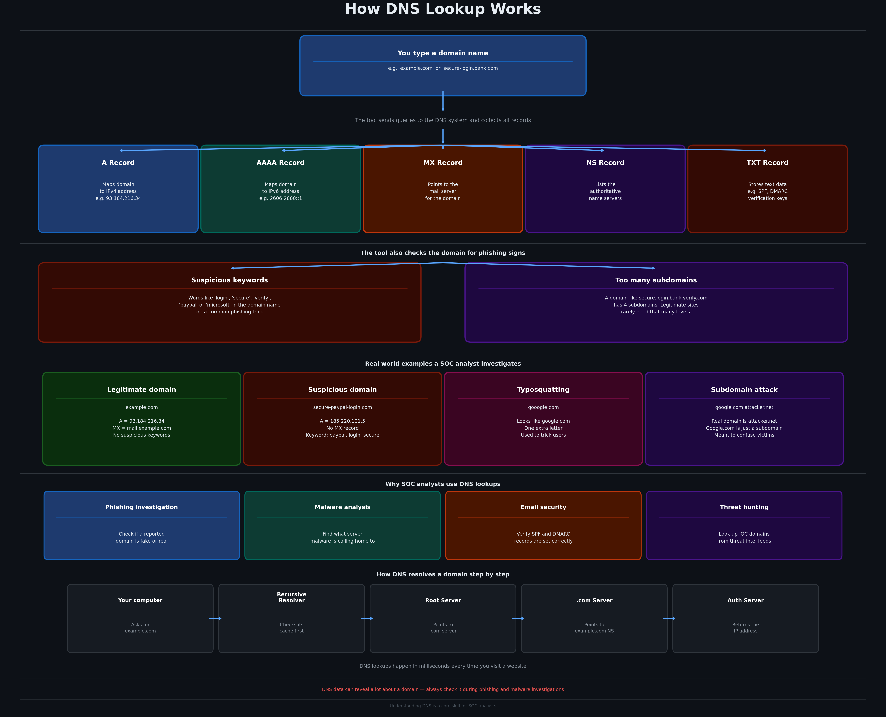

# 🌐 DNS Lookup Tool


This tool looks up all DNS records for a domain and checks it for suspicious signs. It collects A, AAAA, MX, NS and TXT records, does a reverse IP lookup, and warns you if the domain contains phishing keywords or too many subdomain levels. SOC analysts use DNS lookups when investigating phishing reports and malware domains.

---



---

## Features

- Looks up A, AAAA, MX, NS and TXT records for any domain
- Does a reverse DNS lookup on the IP addresses found
- Flags domains with phishing keywords like login, secure, verify or paypal
- Warns when a domain has an unusual number of subdomain levels
- Works with any domain and has a demo mode built in

---

## Requirements

- Python 3.7 or higher
- The `dig` command must be available on your system (installed by default on Linux and macOS)

---

## Installation

```bash
git clone https://github.com/NourKhalil0/soc-projects.git
cd soc-projects/07-dns-lookup
```

---

## Usage

Run the demo on example.com:
```bash
python3 dns_lookup.py --demo
```

Look up a domain:
```bash
python3 dns_lookup.py google.com
```

Check a suspicious domain:
```bash
python3 dns_lookup.py secure-paypal-login.com
```

---

## Example Output

```
Looking up: secure-paypal-login.com

========================================
          DNS LOOKUP REPORT
========================================
Domain       : secure-paypal-login.com
Subdomains   : 0
========================================

A Records (IPv4):
  185.220.101.5  (No reverse DNS)

AAAA Records (IPv6):
  None found

MX Records (Mail):
  None found

NS Records (Name Servers):
  ns1.suspicioushost.com

TXT Records:
  None found

----------------------------------------
WARNING: Suspicious keywords found: secure, paypal, login
This domain may be used for phishing.
========================================
```

---

## What you learn

| Skill | Description |
|-------|-------------|
| DNS fundamentals | Understanding A, MX, NS and TXT records and what they do |
| Phishing detection | Spotting fake domains through keywords and subdomain abuse |
| Threat investigation | Looking up IOC domains the same way a real SOC analyst does |
| Reverse DNS | Finding the hostname behind an IP address |

---

## Project Structure

```
07-dns-lookup/
├── dns_lookup.py
├── diagram.png
├── requirements.txt
├── .gitignore
└── README.md
```

---

## License

MIT

---

*Part of the SOC Projects Portfolio by NourKhalil0*
