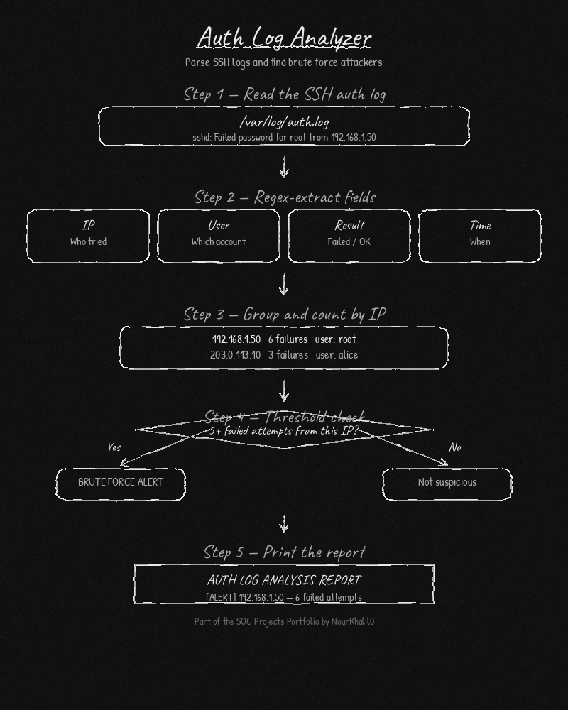

# 08 Auth Log Analyzer

  

This tool reads SSH authentication logs, counts failed login attempts per IP address, tracks successful logins, and flags any IP that crosses a brute force threshold.



## Features

- Parses standard SSH auth log format (auth.log, secure)
- Counts failed login attempts grouped by IP address
- Tracks which usernames were targeted from each IP
- Tracks successful logins separately
- Flags any IP with 5 or more failed attempts as a brute force alert
- Includes a demo mode with built-in sample data, no files needed

## Requirements

- Python 3.8+
- No external packages required

## Installation

```bash
git clone https://github.com/NourKhalil0/soc-projects.git
cd soc-projects/08-auth-log-analyzer
```

## Usage

Run in demo mode with built-in sample data:

```bash
python3 auth_log_analyzer.py --demo
```

Analyze a real auth log file:

```bash
python3 auth_log_analyzer.py --file /var/log/auth.log
```

## Example Output

```
--- Auth Log Analysis Report ---

Failed login attempts by IP:
  192.168.1.50: 6 failed attempt(s) for user(s): root
  203.0.113.10: 3 failed attempt(s) for user(s): alice
  198.51.100.7: 1 failed attempt(s) for user(s): bob

Successful logins by IP:
  10.0.0.5: 1 successful login(s)
  10.0.0.22: 1 successful login(s)
  10.0.0.30: 1 successful login(s)

Suspicious IPs (brute force threshold reached):
  [ALERT] 192.168.1.50 with 6 failed attempts
```

## What You Learn

| Skill | Description |
|---|---|
| Log parsing | Reading and extracting data from system log files |
| Regex | Using regular expressions to find patterns in text |
| IP tracking | Grouping events by source IP address |
| Threat detection | Identifying brute force patterns from login data |
| Reporting | Presenting findings in a clear, readable format |

## Project Structure

```
08-auth-log-analyzer/
├── auth_log_analyzer.py
├── diagram.png
├── README.md
├── requirements.txt
└── .gitignore
```

## License

MIT License

---

Part of the SOC Projects Portfolio by NourKhalil0
