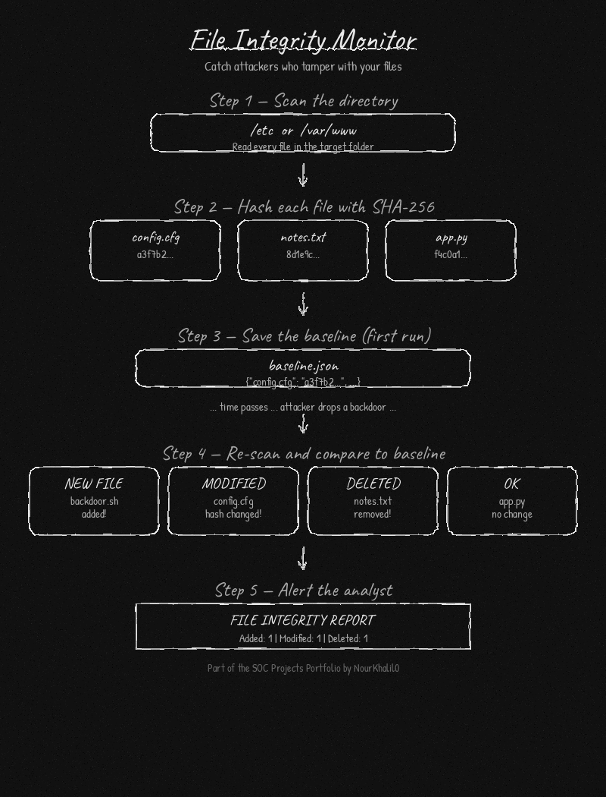

# File Integrity Monitor


This tool scans a directory, computes a SHA-256 hash for every file, and saves the results as a baseline. When you run it again later it compares the current hashes against the saved ones and tells you exactly which files were added, modified, or deleted. SOC analysts use file integrity monitoring to catch attackers who drop backdoors, modify config files, or tamper with system binaries.

---



---

## Features

- Scans any directory and computes a SHA-256 hash for each file
- Saves a baseline JSON snapshot on demand
- Detects new files, modified files, and deleted files on every check
- Shows a clear report with a label for each type of change
- Includes a demo mode that simulates a real attack scenario

---

## Requirements

- Python 3.7 or higher
- No external packages needed

---

## Installation

```bash
git clone https://github.com/NourKhalil0/soc-projects.git
cd soc-projects/09-file-integrity-monitor
```

---

## Usage

Save a baseline of a directory:
```bash
python3 file_integrity_monitor.py /etc --save
```

Check for changes since the baseline:
```bash
python3 file_integrity_monitor.py /etc
```

Use a custom baseline file path:
```bash
python3 file_integrity_monitor.py /var/www --save --baseline /tmp/www_baseline.json
python3 file_integrity_monitor.py /var/www --baseline /tmp/www_baseline.json
```

Run the built-in demo:
```bash
python3 file_integrity_monitor.py --demo
```

---

## Example Output

```
Scanning: /tmp/demo_dir

========================================
      FILE INTEGRITY REPORT
========================================
Directory : /tmp/demo_dir
Added     : 1
Modified  : 1
Deleted   : 1
========================================

NEW FILES:
  [+] /tmp/demo_dir/backdoor.sh

MODIFIED FILES:
  [!] /tmp/demo_dir/config.cfg

DELETED FILES:
  [-] /tmp/demo_dir/notes.txt

----------------------------------------
WARNING: 3 change(s) detected.
Review the files listed above.
========================================
```

---

## What you learn

| Skill | Description |
|-------|-------------|
| File hashing | Using SHA-256 to create a unique fingerprint for any file |
| Change detection | Comparing two snapshots to find added, modified, and deleted files |
| Endpoint security | Understanding how FIM tools like Tripwire and OSSEC work |
| Incident response | Knowing how to check if critical files were tampered with |

---

## Project Structure

```
09-file-integrity-monitor/
├── file_integrity_monitor.py
├── diagram.png
├── requirements.txt
├── .gitignore
└── README.md
```

---

## License

MIT

---

*Part of the SOC Projects Portfolio by NourKhalil0*
