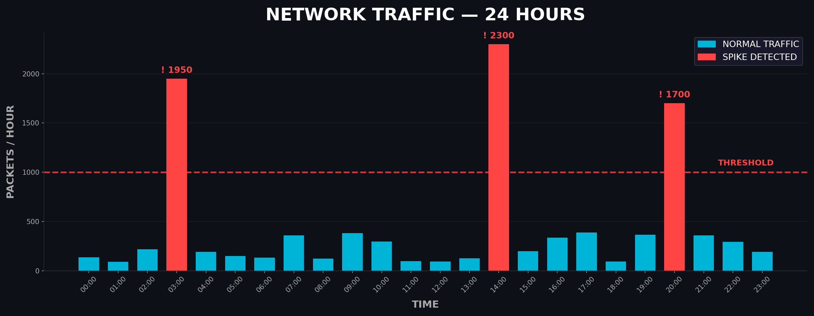

# Traffic Spike Detector


This tool looks at network traffic over 24 hours and finds hours where the traffic is way higher than normal. It saves a graph and a diagram as image files.

---

## How It Works


---

## Traffic Graph



---

## Features

- Checks 24 hours of traffic data
- Flags any hour that goes over the limit
- Saves a bar chart showing normal and spike hours
- Saves a diagram showing how the tool works
- Prints a report in the terminal
- Comes with built-in demo data so you can run it right away

---

## Requirements

- Python 3.8 or higher
- matplotlib

---

## Installation

```bash
git clone https://github.com/NourKhalil0/soc-projects.git
cd soc-projects/09-traffic-spike-detector
pip install -r requirements.txt
```

---

## Usage

```bash
python3 traffic_spike_detector.py
```

---

## Example Output

```
==============================================
    TRAFFIC SPIKE DETECTOR --- REPORT
==============================================
Threshold : 1000 packets/hour
Period    : 24 hours

  SPIKE at 03:00  ---  1950 packets  [ALERT]
  SPIKE at 14:00  ---  2300 packets  [ALERT]
  SPIKE at 20:00  ---  1700 packets  [ALERT]
==============================================
```

---

## What You Learn

| Skill | Description |
|-------|-------------|
| Threshold detection | Finding values that are too high |
| Data visualization | Making charts with matplotlib |
| Network monitoring | Understanding traffic patterns |
| Alert logic | Knowing when to raise a flag |

---

## Project Structure

```
09-traffic-spike-detector/
├── traffic_spike_detector.py
├── traffic_graph.png
├── diagram.png
├── requirements.txt
└── README.md
```

---

## License

MIT

---

*Part of the SOC Projects Portfolio by NourKhalil0*
