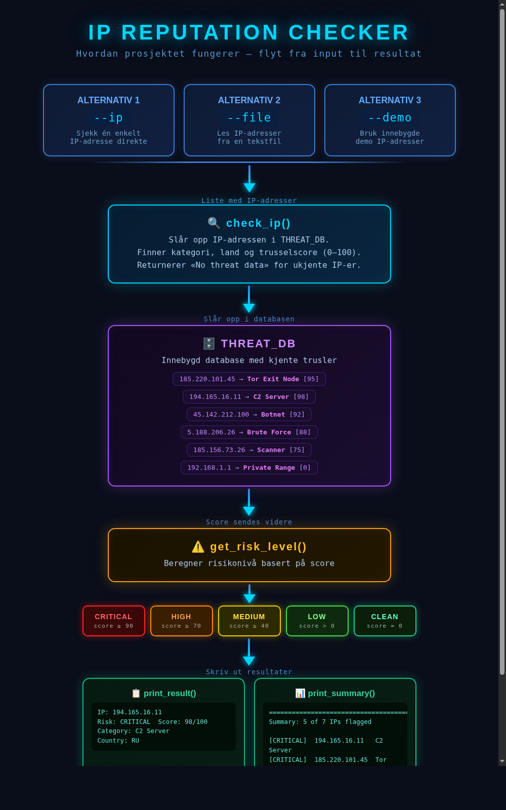

# 10 IP Reputation Checker


A command line tool that checks IP addresses against a local threat database and assigns a risk score. You give it one IP or a list, and it tells you what it found.



## Features

- Check a single IP, a list from a file, or run the built-in demo
- Risk levels: CRITICAL, HIGH, MEDIUM, LOW, CLEAN
- Shows category and country for each flagged IP
- Prints a summary at the end so you can quickly see what needs attention

## Requirements

- Python 3.8 or higher
- No external dependencies for the main script

## Installation

```bash
git clone https://github.com/NourKhalil0/soc-projects.git
cd soc-projects/10-ip-reputation-checker
pip install -r requirements.txt
```

## Usage

Run with a single IP:

```bash
python ip_reputation.py --ip 185.220.101.45
```

Run with a file of IPs (one per line):

```bash
python ip_reputation.py --file ips.txt
```

Run the built-in demo:

```bash
python ip_reputation.py --demo
```

## Example Output

```
IP Reputation Checker
==========================================

IP: 185.220.101.45  Risk: CRITICAL  Score: 95/100
   Category: Tor Exit Node  Country: DE

IP: 8.8.8.8  Risk: CLEAN  Score: 0/100
   Category: No threat data  Country: Unknown

IP: 5.188.206.26  Risk: HIGH  Score: 88/100
   Category: Brute Force  Country: RU

==========================================
Summary: 2 of 3 IPs flagged

  [CRITICAL]  185.220.101.45        Tor Exit Node
  [HIGH    ]  5.188.206.26          Brute Force
```

## What You Learn

| Skill | Description |
|-------|-------------|
| Threat databases | How SOC tools store and look up known bad indicators |
| IP reputation | Why IP scores matter and what categories mean |
| Risk scoring | How to turn raw data into a clear severity level |
| IOC triage | How to quickly identify which IPs need attention |
| argparse | Building usable CLI tools with flags and help text |
| File I/O | Reading structured input files in Python |

## Project Structure

```
10-ip-reputation-checker/
├── ip_reputation.py   # Main script
├── diagram.png        # Workflow diagram
├── README.md          # This file
├── requirements.txt   # Dependencies
└── .gitignore         # Python gitignore
```

## License

MIT

---

Part of the SOC Projects Portfolio by NourKhalil0
