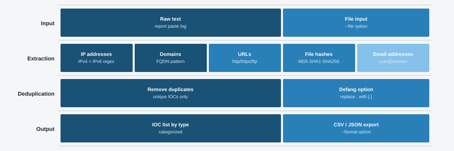

# IOC Extractor

A simple Python tool that pulls Indicators of Compromise (IOCs) out of raw text. Feed it a log file, an alert email, or any block of text and it will find IP addresses, domains, URLs, hashes, and email addresses.

## Diagram



## Features

- Extracts IPv4 addresses with octet validation
- Finds domains with common TLDs
- Captures full HTTP and HTTPS URLs
- Detects MD5 and SHA256 hashes
- Pulls out email addresses
- Removes duplicates automatically
- Supports file input, stdin piping, and demo mode
- Optional JSON output for feeding into other tools

## Requirements

- Python 3.8 or higher
- No external libraries needed (uses only standard library modules)

## Installation

```bash
git clone https://github.com/NourKhalil0/soc-projects.git
cd soc-projects/12-ioc-extractor
```

## Usage

Run the demo to see sample output:

```bash
python3 ioc_extractor.py --demo
```

Scan a text file:

```bash
python3 ioc_extractor.py --file alert_report.txt
```

Pipe text from another command:

```bash
cat /var/log/syslog | python3 ioc_extractor.py
```

Get JSON output:

```bash
python3 ioc_extractor.py --demo --json
```

## Example Output

```
=== IOC Extractor (Demo Mode) ===

[IPV4] (4 found)
  10.0.0.50
  172.16.0.23
  192.168.1.105
  45.33.32.156

[DOMAINS] (5 found)
  company.org
  data-exfil.ru
  malicious-login.com
  malware-c2.evil.xyz
  phish-domain.net

[URLS] (2 found)
  http://data-exfil.ru/upload
  https://malicious-login.com/steal?id=4827

[MD5_HASHES] (1 found)
  5d41402abc4b2a76b9719d911017c592

[SHA256_HASHES] (1 found)
  7d793037a076ef8cd0b26ce2678e2a8df39c75b8c9f3f15e8023b3c3e0384b01

[EMAILS] (2 found)
  attacker@phish-domain.net
  victim@company.org

Total IOCs extracted: 15
```

## What You Learn

| Topic | Description |
|-------|-------------|
| Regular Expressions | Writing regex patterns to match IPs, hashes, domains, and URLs |
| Text Parsing | Reading and scanning unstructured text for structured data |
| IOC Types | Understanding the main types of indicators used in threat detection |
| Data Deduplication | Removing duplicate findings from extraction results |
| CLI Design | Building a tool with argparse that accepts files, stdin, and flags |
| JSON Output | Formatting results for use with other security tools |

## Project Structure

```
12-ioc-extractor/
├── ioc_extractor.py
├── diagram.svg
├── requirements.txt
├── .gitignore
└── README.md
```

## Known issues

The domain regex sometimes picks up things that are not domains (e.g. version strings like "3.8.1" get flagged). Filtering is basic. Will improve.

## License

MIT

---

Part of the SOC Projects Portfolio by NourKhalil0
