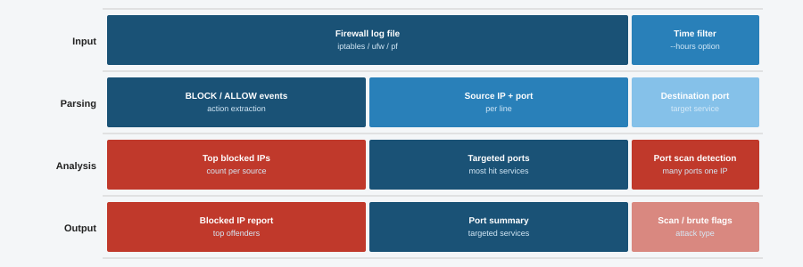

# 13 - Firewall Log Analyzer

This tool reads firewall logs line by line and looks for signs of attacks. It counts which IPs are getting blocked the most, shows which ports are being targeted, and flags potential port scans and brute force attempts.



## Features

- Parses firewall log lines with action, protocol, source IP, and destination port
- Counts how many times each source IP was blocked
- Shows the top 5 most targeted ports
- Detects port scans when a single IP hits 5 or more unique ports
- Detects brute force attempts when an IP is blocked 5 or more times
- Includes a built-in demo mode so you can test it right away

## Requirements

- Python 3.8 or higher
- matplotlib

## Installation

```bash
git clone https://github.com/NourKhalil0/soc-projects.git
cd soc-projects/13-firewall-log-analyzer
pip install -r requirements.txt
```

## Usage

Run with demo data:

```bash
python3 firewall_analyzer.py --demo
```

Analyze your own log file:

```bash
python3 firewall_analyzer.py --file /var/log/firewall.log
```

Each line in the log file should follow this format:

```
YYYY-MM-DD HH:MM:SS ACTION PROTO SRC_IP -> DST_IP:PORT
```

For example:

```
2024-01-15 08:23:11 DENY TCP 192.168.1.100 -> 10.0.0.5:22
2024-01-15 09:10:00 ALLOW TCP 10.0.0.50 -> 8.8.8.8:53
```

Lines that do not match this format are skipped.

## Example Output

```
=== Firewall Log Report ===
Total events  : 14
Allowed       : 2
Blocked       : 12

Top blocked sources:
  192.168.1.100          6 blocks
  198.51.100.22          5 blocks
  203.0.113.45           1 blocks

Top blocked ports:
  Port 22       7 hits
  Port 80       1 hits
  Port 443      1 hits
  Port 8080     1 hits
  Port 3389     1 hits

[ALERT] Port scan from 192.168.1.100: [21, 22, 80, 443, 3389, 8080]
[ALERT] Brute force from 192.168.1.100: 6 blocked attempts
[ALERT] Brute force from 198.51.100.22: 5 blocked attempts
```

## Known limitations

Currently only tested on ufw log format. iptables raw output will need regex adjustments. No support for Windows Firewall logs yet.


| Skill | Description |
|-------|-------------|
| Log Parsing | Reading structured log files with regex |
| Pattern Detection | Spotting port scans and brute force in raw data |
| Data Aggregation | Counting events and ranking by frequency |
| Alert Logic | Writing simple rules to flag suspicious behavior |
| argparse | Building a proper CLI with flags |

## Project Structure

```
13-firewall-log-analyzer/
├── firewall_analyzer.py   main script
├── diagram.svg            analysis flow diagram
├── requirements.txt       dependencies
├── .gitignore             Python ignores
└── README.md              this file
```

## License

MIT

---

Part of the SOC Projects Portfolio by NourKhalil0
