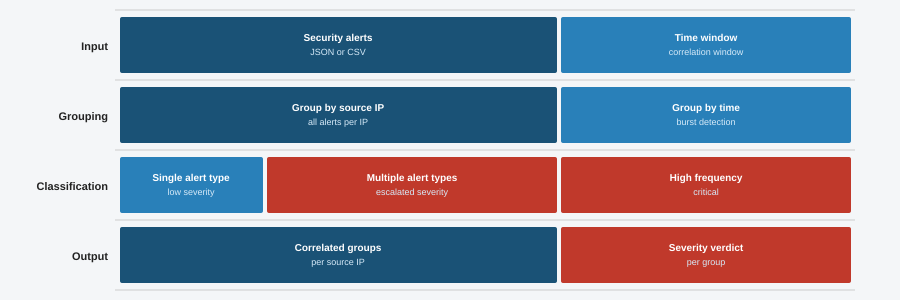

# 15 Alert Correlator

This tool takes a list of security alerts and groups them by source IP. It counts how many alerts came from each IP, looks at what kinds of alerts they triggered, and assigns a severity level based on that. The goal is to spot when one source is responsible for multiple types of attacks, which is a common sign of a more serious threat.



## Features

- Groups alerts by source IP address
- Tracks how many alerts each source triggered
- Collects all unique alert types per source
- Classifies each source as CRITICAL, HIGH, MEDIUM, or LOW severity
- Sorts the report from most to least severe
- Includes a built-in demo mode so you can run it with no setup

## Requirements

- Python 3.8 or higher
- No external packages needed for the main script

For diagram generation only:

```
matplotlib
```

## Installation

```bash
git clone https://github.com/NourKhalil0/soc-projects.git
cd soc-projects/15-alert-correlator
pip install -r requirements.txt
```

## Usage

Run with demo data:

```bash
python3 alert_correlator.py --demo
```

Run with your own events file:

```bash
python3 alert_correlator.py --file events.jsonl
```

Each line in the file should be a JSON object with these fields:

```json
{"time": "2024-01-15 08:01:22", "src_ip": "192.168.1.50", "type": "failed_login", "dest": "server01"}
```

## Example Output

```
=== Alert Correlation Report ===

Source IP : 10.0.0.99
  Severity : CRITICAL
  Alerts   : 3
  Types    : data_exfil, dns_beacon, malware_detected
  Reason   : Multiple attack types from same source (possible APT)

Source IP : 172.16.0.5
  Severity : CRITICAL
  Alerts   : 3
  Types    : failed_login, privilege_escalation, sql_injection
  Reason   : Multiple attack types from same source (possible APT)

Source IP : 192.168.1.50
  Severity : HIGH
  Alerts   : 6
  Types    : failed_login, port_scan
  Reason   : High alert volume from this IP (possible automated attack)

Source IP : 203.0.113.7
  Severity : LOW
  Alerts   : 1
  Types    : failed_login
  Reason   : Single alert type, low volume
```

## What You Learn

| Topic | What it covers |
|-------|----------------|
| Alert correlation | How SOC analysts link events to the same source |
| Severity classification | Rules for deciding how dangerous an alert pattern is |
| APT detection basics | Why multiple alert types from one IP is a red flag |
| SIEM concepts | How raw events become actionable alerts |
| Python data grouping | Using defaultdict to bucket and count events |

## Project Structure

```
15-alert-correlator/
├── alert_correlator.py   # Main script
├── diagram.svg           # Pipeline diagram
├── requirements.txt      # Dependencies
├── .gitignore            # Python gitignore
└── README.md             # This file
```

## License

MIT

---

Part of the SOC Projects Portfolio by NourKhalil0
