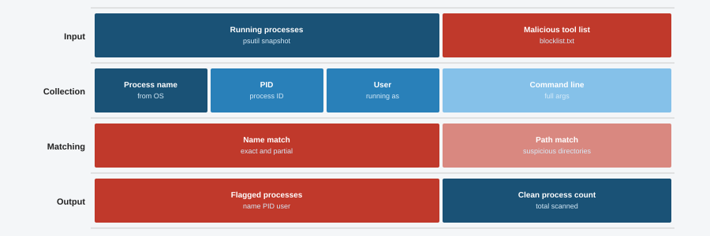

# 16 Process Monitor

A simple tool that scans a list of running processes and flags any that match known malicious tools. You give it a snapshot of processes (or use demo mode) and it tells you which ones look suspicious.



## Features

- Checks process names against a built in list of known offensive tools like mimikatz, psexec, meterpreter, and more
- Accepts a JSON file with process data or generates random demo data
- Prints a clean report with PID, name, user, and alert status for every suspicious match
- Case insensitive matching so it catches tools regardless of capitalization
- Demo mode works with no external files or setup

## Requirements

- Python 3.8 or higher
- No external libraries needed (standard library only)

## Installation

```bash
git clone https://github.com/NourKhalil0/soc-projects.git
cd soc-projects/16-process-monitor
```

## Usage

Run with demo data:

```bash
python3 process_monitor.py --demo
```

Run with your own JSON file:

```bash
python3 process_monitor.py --input processes.json
```

The JSON file should be a list of objects, each with `pid`, `name`, and `user` fields:

```json
[
  {"pid": 1234, "name": "sshd", "user": "root"},
  {"pid": 5678, "name": "mimikatz.exe", "user": "admin"}
]
```

## Example Output

```
============================================================
PROCESS MONITOR REPORT
Scan time: 2026-04-09 10:30:15
Total processes scanned: 30
Suspicious processes found: 4
============================================================

ALERTS:
------------------------------------------------------------
  PID: 23456
  Name: mimikatz.exe
  User: admin
  Status: SUSPICIOUS
------------------------------------------------------------
  PID: 41023
  Name: psexec.exe
  User: root
  Status: SUSPICIOUS
------------------------------------------------------------
```

## What You Learn

| Topic | Description |
|-------|-------------|
| Process monitoring | How to inspect running processes for known threats |
| IOC matching | Comparing system data against a list of indicators |
| Incident response | Quickly checking a host for attacker tools |
| JSON parsing | Loading and working with structured data files |
| Reporting | Building clear output for security analysts |

## Project Structure

```
16-process-monitor/
├── process_monitor.py
├── diagram.svg
├── requirements.txt
├── .gitignore
└── README.md
```

## TODO

- Replace simulated process list with real psutil integration
- Add config file for blocklist instead of hardcoding
- Test on Windows (currently Linux only)

## License

MIT

---

Part of the SOC Projects Portfolio by NourKhalil0
