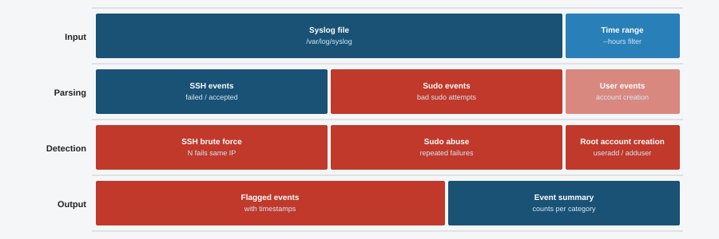

# 17 - Syslog Analyzer

This tool reads system log files and flags suspicious events. It checks for SSH brute force attempts, dangerous sudo commands, new root-level accounts, and kernel warnings. Each finding gets a severity label so you can see the most serious problems first.



## Features

- Parses real syslog or auth.log files line by line
- Detects SSH login failures and successful logins
- Flags sudo commands that use tools like bash, wget, curl, and netcat
- Alerts on new user accounts especially ones created with UID 0
- Detects OOM killer events and kernel segfaults
- Groups SSH failures by source IP and flags brute force if there are 3 or more
- Sorts all findings by severity: CRITICAL, HIGH, MEDIUM, INFO
- Includes a demo mode that works with no external files

## Requirements

- Python 3.8 or higher
- No external packages needed

## Installation

```bash
git clone https://github.com/NourKhalil0/soc-projects.git
cd soc-projects/17-syslog-analyzer
```

## Usage

Run with demo data:

```bash
python3 syslog_analyzer.py --demo
```

Analyze a real syslog file:

```bash
python3 syslog_analyzer.py --log /var/log/syslog
```

Analyze an auth log:

```bash
python3 syslog_analyzer.py --log /var/log/auth.log
```

## Example Output

```
Syslog Analyzer
========================================
Scanning 9 lines...

[CRITICAL] Root-level account created
[HIGH] Suspicious sudo by user1: /bin/bash
[HIGH] OOM killer triggered
[HIGH] Suspicious sudo by user2: /usr/bin/wget
[HIGH] Brute force from 192.168.1.100 (3 failures)
[MEDIUM] Segfault in kernel log
[MEDIUM] SSH failure from 192.168.1.100
[MEDIUM] SSH failure from 192.168.1.100
[MEDIUM] SSH failure from 192.168.1.100
[INFO] SSH login by admin from 10.0.0.5

Total findings: 10
```

## What You Learn

| Skill | Description |
|-------|-------------|
| Log parsing | How to read and process system log files line by line |
| Regex | How to extract IP addresses, usernames, and commands from log text |
| Severity classification | How to sort events from CRITICAL down to INFO |
| Brute force detection | How to count repeated failures per source and trigger an alert |
| Syslog format | What the standard syslog format looks like and what fields it contains |
| Threat indicators | What events in system logs are considered suspicious in a SOC |

## Project Structure

```
17-syslog-analyzer/
├── syslog_analyzer.py   # Main script
├── diagram.svg          # Visual overview of the tool
├── requirements.txt     # No external dependencies
├── .gitignore           # Python gitignore
└── README.md            # This file
```

## License

MIT

---

Part of the SOC Projects Portfolio by NourKhalil0
