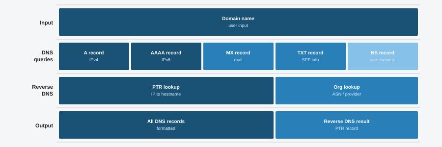

# 18 - Domain Info Lookup

A simple tool that looks up DNS records and reverse DNS information for a given domain. SOC analysts use this kind of tool during investigations to quickly see what IPs a domain resolves to and what hostnames those IPs map back to.



## Features

- Resolves IPv4 (A) and IPv6 (AAAA) records for any domain
- Performs reverse DNS lookups on each resolved IP
- Prints a clean, formatted report with timestamps
- Works with a `--demo` flag so you can test it without any network access
- Uses only the Python standard library for lookups

## Requirements

- Python 3.8 or higher
- matplotlib (only needed to regenerate the diagram)

## Installation

```bash
git clone https://github.com/NourKhalil0/soc-projects.git
cd soc-projects/18-domain-info-lookup
pip install -r requirements.txt
```

## Usage

Run with a real domain:

```bash
python domain_info_lookup.py --domain example.com
```

Run in demo mode with sample data:

```bash
python domain_info_lookup.py --demo
```

## Example Output

```
==================================================
  Domain Info Lookup Report
==================================================
  Domain:    example-target.com
  Scanned:   2026-04-13 21:17:24
--------------------------------------------------
  DNS Records:
    A      -> 93.184.216.34
    A      -> 93.184.216.35
    AAAA   -> 2606:2800:220:1:248:1893:25c8:1946
--------------------------------------------------
  Reverse DNS:
    93.184.216.34 -> server1.example-target.com
    93.184.216.35 -> server2.example-target.com
==================================================
```

## What You Learn

| Topic | Description |
|-------|-------------|
| DNS resolution | How domains get translated into IP addresses |
| Reverse DNS | Mapping IPs back to hostnames for context |
| OSINT basics | Gathering open source intelligence on infrastructure |
| Socket programming | Using Python sockets for network lookups |
| Argparse | Building CLI tools with flags and options |

## Project Structure

```
18-domain-info-lookup/
├── domain_info_lookup.py
├── generate_diagram.py
├── diagram.svg
├── requirements.txt
├── .gitignore
└── README.md
```

## License

MIT

---

Part of the SOC Projects Portfolio by NourKhalil0
